### Work done by Sara Eilenstine, course is through <a href="https://www.boot.dev/">Boot.dev</a>!

<br>

# Assignment 1: COUNTING THE ITEMS IN A LIST

Remember that we can iterate over all the elements in a list using a loop. For example, the following code will print each item in the sports list.

```python
for i in range(0, len(sports)):
    print(sports[i])
```

## ASSIGNMENT

Our players need a way to see how many copies of a specific item they have within their inventory!

Let's finish the get_item_counts function. Within the loop, check if the items are a Potion, Bread, or Shortsword, then add up how many there are of each by incrementing the potion_count, bread_count and shortsword_count variables respectively.

### TIP

// The example shows you how to access the values in a list. Combine this with what you know about comparison and assignment operators to complete the assignment.

# <span style="color:teal">Solution</span>

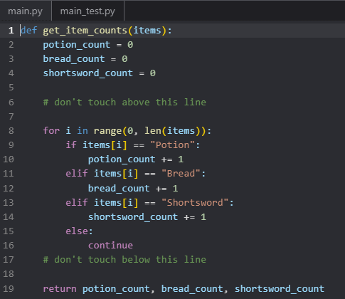
<br>


# Assignment 2: FIND AN ITEM IN A LIST

Example of "no-index" or "no-range" syntax:

```python
for fruit in fruits:
print(fruit)
```

## ASSIGNMENT

We need to check if a player has a specific item in their inventory. In the contains_leather_scraps function, use the no-index syntax to iterate over each item in items. If you find an item called Leather Scraps, set the found variable to True.

# <span style="color:teal">Solution</span>

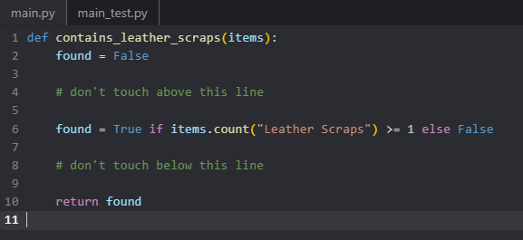
<br>


# Assignment 3: FIND THE INCREASE

## ASSIGNMENT

We keep track of each character's level in a list. When someone levels up, we want to know about it so we can congratulate them! Your assignment is to compare the `old_character_levels` and `new_character_levels` lists and to print the index where a character's level increased.

The existing code in the loop you've been given loops over all of the indexes in `old_character_levels`. Because `old_character_levels` and `new_character_levels` are the same lengths, you can reuse `i` to index into both.

Fill in the loop with code that prints the indexes where the item in the first list is less than the item in the second list. For example, if the lists are:

```python
old_character_levels = [2, 5, 3, 7, 5]
new_character_levels = [1, 5, 19, 7, 8]
```

Then your code should print these indexes:

```python
2
4
```

# <span style="color:teal">Solution</span>

## 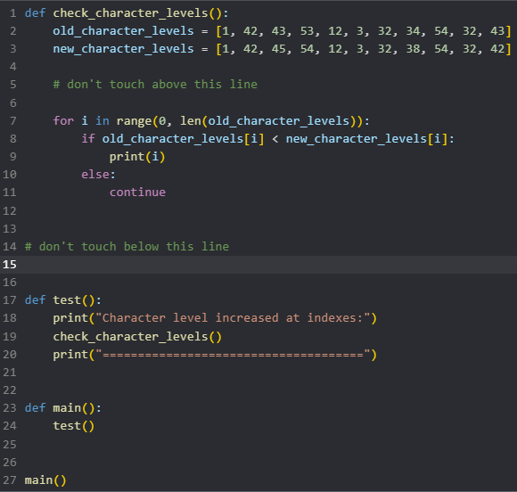

<br>


# Assignment 4: FIND MAX

## INFINITY

The built-in float() function can create a numeric floating point value of negative infinity. Because _every value_ will be greater than negative infinity, we can use it to help us accomplish our goal of finding the max value. I've added it for you as the starting value of `max_so_far`.

```python
negative_infinity = float('-inf')
positive_infinity = float('inf')
```

## ASSIGNMENT

Our players want a way to see their strongest attack from their last combat. Let's add another function to analyze data from our combat log.

Complete the `find_max` function that looks at each number in the `nums` list and returns the maximum value. If no maximum is found, it just returns negative infinity.

### Example

```python
find_max([100, 10, 22])
# returns 100
```

# <span style="color:teal">Solution</span>

## 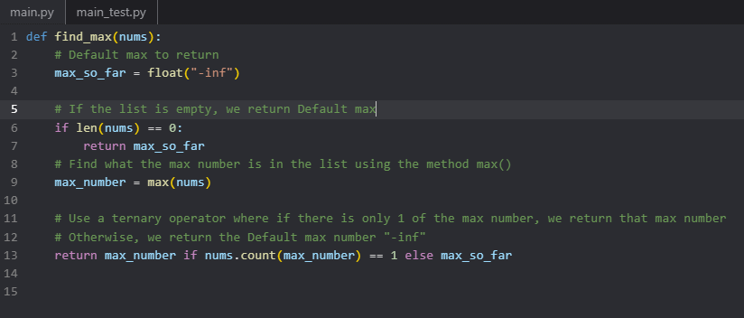

<br>


# Assignment 5: MODULO OPERATOR IN PYTHON

## THE MODULO OPERATOR CAN BE USED TO FIND A REMAINDER:

For example, `7 % 2` would be `1`, because 2 can be multiplied evenly into 7 at most 3 times:

```python
2 * 3 = 6
```

Then there is 1 remaining to get from `6` to `7`.

```python
7 - 6 = 1
```

The modulo operator is the percent sign: %. It's important to recognize modulo is not a percentage though! That's just the symbol we're using.

```python
remainder = 8 % 3
# remainder = 2
```

An odd number is a number that when divided by `2`, the remainder is not `0`.

## ASSIGNMENT

Inside the loop in the `get_odd_numbers` function, use the modulo operator to check if each number, i, is odd. If a number is odd, append it to the `odd_numbers` list.

# <span style="color:teal">Solution</span>

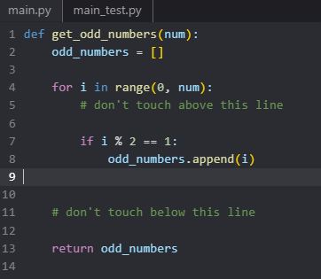
<br>


# Assignment 6: SLICING LISTS

Python makes it easy to slice and dice lists to work only with the section you care about. One way to do this is to use the simple slicing operator, which is just a colon `:`.

With this operator, you can specify where to start and end the slice, and how to step through the original. List slicing returns a new list from the existing list.

The syntax is as follows:

```python
my_list[ start : stop : step ]
```

For example:

```python
scores = [50, 70, 30, 20, 90, 10, 50]
# Display list
print(scores[1:5:2])
# Prints [70, 20]
```

The above reads as "give me a slice of the `scores` list from index 1, up to but not including 5, skipping every 2nd value. _All of the sections are optional._

## OMITTING SECTIONS

You can also omit various sections ("start", "stop", or "step"). For example, `numbers[:3]` means "get all items from the start up to (but not including) index 3". `numbers[3:]` means "get all items from index 3 to the end".

```python
numbers = [0, 1, 2, 3, 4, 5, 6, 7, 8, 9]
numbers[:3] # Gives [0, 1, 2]
numbers[3:] # Gives [3, 4, 5, 6, 7, 8, 9]
```

## USING ONLY THE "STEP" SECTION

```python
numbers = [0, 1, 2, 3, 4, 5, 6, 7, 8, 9]
numbers[::2] # Gives [0, 2, 4, 6, 8]
```

## NEGATIVE INDICES

Negative indices count from the end of the list. For example, `numbers[-1]` gives the last item in the list, `numbers[-2]` gives the second last item, and so on.

```python
numbers = [0, 1, 2, 3, 4, 5, 6, 7, 8, 9]
numbers[-3:] # Gives [7, 8, 9]
```

## ASSIGNMENT

Complete the given `get_champion_slices` function. It takes a list of `champions` and should return three new lists based on the given champions:

1. First, return a slice of the `champions` list that starts with the third champion and goes to the end of the list.
2. Next, return a slice of the `champions` list that starts at the beginning of the list and ends with the third champion from the end (inclusive).
3. Last, return a slice of the `champions` list that only includes the champions in even numbered indexes.

### TIP

// Remember, you can return multiple values from a function by separating them with commas:

```python
return value1, value2, value3
```

# <span style="color:teal">Solution</span>

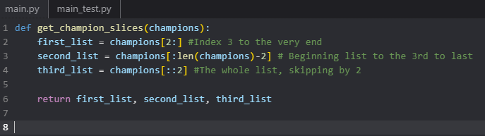
<br>


# Assignment 7: LIST OPERATIONS - CONCATENATE

Concatenating two lists (smushing them together) is easy in Python, just use the `+` operator.

```python
total = [1, 2, 3] + [4, 5, 6]
print(total)
# Prints: [1, 2, 3, 4, 5, 6]
```

## ASSIGNMENT

Fantasy Quest allows users to keep lists of their favorite items. Your job is to finish the `concatenate_favorites function`. It takes three different parameters - the player's `favorite_weapons`, `favorite_armor` and `favorite_items`.

1. Create a new list that combines `favorite_weapons`, `favorite_armor`, and `favorite_items` in this order.
2. Return the list containing the combined favorites.

# <span style="color:teal">Solution</span>

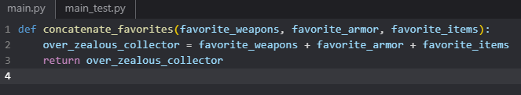
<br>


# Assignment 8: LIST OPERATIONS - CONTAINS

Checking whether a value exists in a list is also really easy in Python, just use the `in` keyword.

```python
fruits = ["apple", "orange", "banana"]
print("banana" in fruits)
# Prints: True
```

## ASSIGNMENT

Our players have requested an in-game feature that will allow them to type in a weapon name to check if it's in the list of top weapons in the realm.

Complete the `is_top_weapon` function. It should return `True` if the weapon is in the `top_weapons` list, otherwise it should return `False`.

# <span style="color:teal">Solution</span>

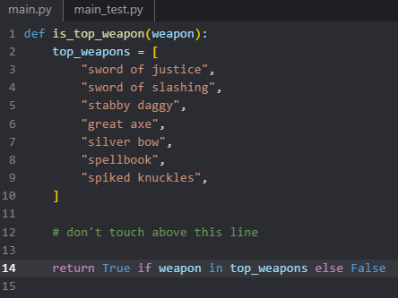
<br>


# Assignment 9: LIST DELETION

Python has a built-in keyword <a href="https://docs.python.org/3/tutorial/datastructures.html#the-del-statement">del</a> that deletes items from objects. In the case of a list, you can delete specific indexes or entire slices.

```python
nums = [1, 2, 3, 4, 5, 6, 7, 8, 9]

# delete the fourth item
del nums[3]
print(nums)
# Output: [1, 2, 3, 5, 6, 7, 8, 9]

# delete the second item up to (but not including) the fourth item
nums = [1, 2, 3, 4, 5, 6, 7, 8, 9]
del nums[1:3]
print(nums)
# Output: [1, 4, 5, 6, 7, 8, 9]

# delete all elements
nums = [1, 2, 3, 4, 5, 6, 7, 8, 9]
del nums[:]
print(nums)
# Output: []
```

## ASSIGNMENT

In Fantasy Quest there is a list of strongholds on the map that players can visit to defeat powerful bosses. Let's update the `trim_strongholds` function to:

1. Delete the first stronghold from the list
2. Delete the last two strongholds from the list
3. Return the new trimmed-down list

# <span style="color:teal">Solution</span>

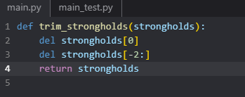
<br>


# Assignment 10: TUPLES

Tuples are collections of data that are ordered and unchangeable. You can think of a tuple as a `List` with a fixed size. Tuples are created with round brackets:

```python
my_tuple = ("this is a tuple", 45, True)
print(my_tuple[0])
# this is a tuple
print(my_tuple[1])
# 45
print(my_tuple[2])
# True
```

While it's typically considered bad practice to store items of different types in a List it's not a problem with Tuples. Because they have a fixed size, it's easy to keep track of which indexes store which types of data.

Tuples are often used to store very small groups (like 2 or 3 items) of data. For example, you might use a tuple to store a dog's name and age.

```python
dog = ("Fido", 4)
```

_Note: There is a special case for creating single-item tuples. You must include a comma so Python knows it's a tuple and not regular parentheses._

```python
dog = ("Fido",)
```

Because Tuples hold their data, multiple tuples can be stored within a list. Similar to storing other data in lists, each tuple within the list is separated by a comma. When accessing tuples the first index relates to which tuple you want to access, the second relates to the values within that tuple.

```python
my_tuples = [("this is the first tuple in the list", 45, True),
("this is the second tuple in the list", 21, False)]

print(my_tuples[0][0]) # this is the first tuple in the list
print(my_tuples[0][1]) # 45
print(my_tuples[1][0]) # this is the second tuple in the list
print(my_tuples[1][2]) # False
```

## ASSIGNMENT

The "Fantasy Quest" character system needs a list of "heroes" to be able to run the game properly. Someone wrote some pretty nasty code, and the code in question creates a `heroes` list where every 3rd index defines a new hero. First their name, then their age, then whether or not they're an "elf".

Change the heroes list declaration from its current state to a list of tuples. Use the same data for each hero, and order it in the same way.

# <span style="color:teal">Solution</span>

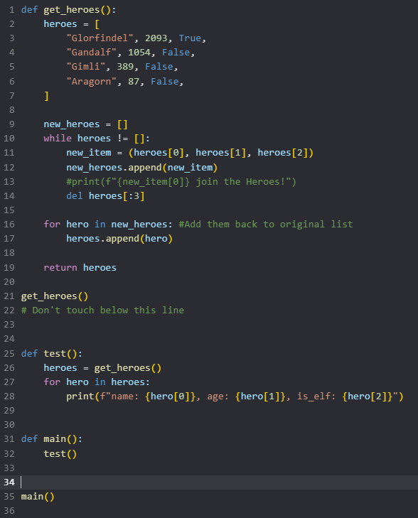
<br>


# Assignment 11: FIRST ELEMENT

## ASSIGNMENT

Let's add another function to our inventory system. Write a function that returns the first element from a list. If the list is empty then return the string `ERROR` instead.

# <span style="color:teal">Solution</span>

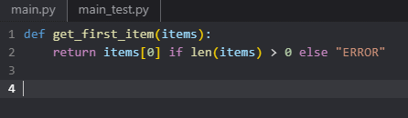
<br>


# Assignment 12: REVERSE LIST

## ASSIGNMENT

Some of our players would like to view their inventories in reverse order.

Let's write a function that takes a list as an input and returns a new list except all the items are in reverse order.

For example:

```python
[1, 2, 3] -> [3, 2, 1]
['a', 'b', 'c', 'd'] -> ['d', 'c', 'b', 'a']
```

### TIP

// The Python range function is very useful when working with lists. Alternately, you may want to use list slicing.

1. Where should you start your loop from?
2. Where should you end your loop?
3. What should the step be? In other words, how should you increment `i` in each iteration of the loop?

# <span style="color:teal">Solution</span>

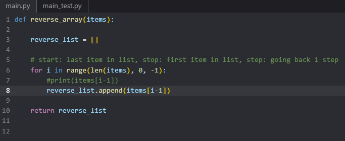
<br>


# Assignment 13: FILTER MESSAGES

You are about to write a bit more code in a single function than you have before.

Do not try to write it all at once. Start with the outermost loop, and work your way inwards. Add extra `print()` statements and run your code often to make sure it's doing what you expect. Just make sure to remove the extra `print()` statements before submitting your code.

Running your code often to make sure each line is doing what you expect is called "debugging". All programmers, even seasoned professionals, break large problems down into small ones that they can debug line by line.

## ASSIGNMENT

We need to filter the profanity out of our game's live chat feature! Complete the filter_messages function. It takes a list of chat messages as input and returns 2 new lists:

1. A list of the same messages but with all instances of the word dang removed.
2. A list containing the number of dang words that were removed from the message at that particular index.
   For example:

```python
messages = ["dang it bobby!", "look at it go"]
filter_messages(messages) # returns ["it bobby!", "look at it go"], [1, 0]
```

**Here are the steps for you to follow:**

1. Create the 2 empty lists that you'll return at the end. One for the filtered messages, and one for counts of words removed.
2. For each message in the input list:
   1. Split the message into a list of words using the `.split()` string method (see below for help).
   2. Create a new empty list for all the non-bad words for this message.
   3. Create a `counter` variable and set it to 0. We'll increment this when we remove words from this message.
   4. For each word in the message:
      1. If the word is `dang`, increment the `counter`
      2. If it is not `dang`, add the word to the non-bad word list you created
   5. Join the list of non-bad words into a single string using the `.join()` method (see below for help)
   6. Append the new clean message to the final list of filtered messages
   7. Append the count of bad words removed to its list
   8. Return the filtered messages first, then the counters

## TIPS

## // SPLIT A STRING INTO A LIST OF WORDS

The `.split()` method is called on a string. If you don't pass it any arguments, it will just split the words in the string on the whitespace.

```python
message = "hello there sam"
words = message.split()
print(words)
# Prints: ["hello", "there", "sam"]
```

## // JOIN A LIST OF STRINGS INTO A SINGLE STRING

The `.join()` method is called on a delimiter (what goes between all the words in the list), and takes a list of strings as input.

```python
list_of_words = ["hello", "there", "sam"]
sentence = " ".join(list_of_words)
print(sentence)
# Prints: "hello there sam"
```

# <span style="color:teal">Solution</span>

```python
def filter_messages(messages):
    """
    Expected output:
        A list of the same messages but with all instances of the word dang removed.
        A list containing the number of dang words that were removed from the message at that particular index.
    """
    dang_counts = []
    no_dangs_here = []

    for chat in messages:             # >>> "lets fight one on one"
        split_sentence = chat.split() # >>> ['lets', 'fight', 'one', 'on', 'one']
        temp_sentence_holder = []     # >>> Reset to [] for inner for loop
        counter = 0                   # >>> Reset to 0 for inner for loop
        #print("New Sentence:")

        for word in split_sentence:   # >>> "lets"

            if word == "dang":
                counter += 1
                #print(f"Found a bad word: {counter}")
            else:
                #print(f"Adding ''{word}'' to the temp_holder")
                temp_sentence_holder.append(word)

            #print(word)
            #print(temp_sentence_holder)

        # Debugging Print Statements
        sentence = " ".join(temp_sentence_holder)
        no_dangs_here.append(sentence)
        dang_counts.append(counter)
        #print(f"Appending {counter} to dang_counts")
        #print(dang_counts)
        #print(f"Counter Resetting!\n")

    #print(no_dangs_here)
    #print(dang_counts)
    return no_dangs_here, dang_counts

#messages = ["this dang thing won't work", "lets fight one on one"] #
#filter_messages(messages)

```

<br>


# Optional 1: EVENS AND ODDS

You've been asked to write a program that will calculate how many odd and even numbers exist in a list.

## CHALLENGE

Write the `get_odds_and_evens` function to loop through the numbers list and check if each number in the list is either odd or even.

Increment the `num_evens` counter if even, and the `num_odds` counter if it's odd. Lastly, return the two values `num_odds` and num_evens in that order.

## TIP

// Remember, you can check if a number is even by using the modulo operator (`%`).

# <span style="color:teal">Solution</span>

```python
def get_odds_and_evens(numbers):
    num_evens = 0
    num_odds = 0

    # Don't touch above this line

    for i in numbers:
        if i % 2 == 0:
            num_evens += 1
        else:
            num_odds += 1

    return num_odds, num_evens
```

<br>


# Optional 2: EVEN TEAMS

Students at the local wizarding school have been spending too much time trying to split their players up into even teams. The coach has provided you with a list of the players in the class and has asked you to write a program that will split the players into even teams.

## CHALLENGE

Complete the `split_players_into_teams` function. Use a slice with a "step" to create two new lists from the `players` list:

1. `even_team` should have the players with even-numbered indexes.
2. `odd_team` should have the players with odd-numbered indexes.

Return `even_team` and `odd_team` in that order.

## HINT

// You might want to use a <a href= "https://www.learnbyexample.org/python-list-slicing/">slice</a> with a "step" value:

```python
my_list[ start : stop : step ]
```

# <span style="color:teal">Solution</span>

```python
def split_players_into_teams(players):

    even = players[0: len(players): 2]
    odd = players[1: len(players): 2]

    #print(players)
    return even, odd
```

<br>


# Optional 3: TEST SCORES

Your teacher has been manually grading tests by hand and it has been taking up _all_ of her free time. The Bachelor isn't going to watch itself tonight.

She has asked you to write a program that compares an answer key to a student's multiple-choice answers and calculates the percentage of questions they got right.

## CHALLENGE

Finish the `get_test_scores` function by looping over the `answer_sheet` and `student_answers` lists. <br>
Calculate and return the student's score.

For example, if these were the lists:

```
answer_sheet = ["A", "A", "C", "D"]
student_answers = ["A", "B", "C", "D"]
```

Then the `percentage` would be `75.00`. The percentage should be a **float**, not an integer.

# <span style="color:teal">Solution</span>

```python

```

<br>


### Work done by Sara Eilenstine, course is through <a href="https://www.boot.dev/">Boot.dev</a>!

<br>


