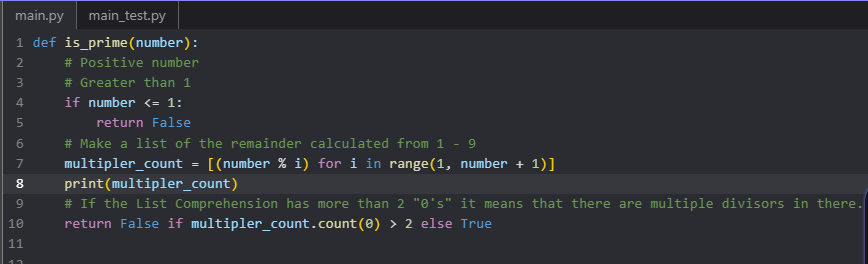

# PRIME & MODULOS

A math student is working on a project and needs an easy way to determine whether or not a number is prime. She asked you to write a program to help her.

## CHALLENGE

Write a function that takes a single number as input and returns True if it is a prime number or False if it is not.

## WHAT IS A PRIME NUMBER?

A prime number is a positive integer, greater than 1, that is only divisible by itself and 1. For example, 2, 3, 5, and 7 are all prime numbers, but 1, 4, 6, 8, and 9 are not.

## TIP

0 and 1 are not prime numbers! And don't forget to catch all negative numbers!

We'll talk more about it next chapter, but you can use the modulo operator % to find a remainder. For example, 7 modulo 2 would be 1, because 2 can be multiplied evenly into 7 at most 3 times.

```
remainder = 8 % 3
# remainder = 2
```

```
remainder = 9 % 3
# remainder = 0
```

## Solution

I'm really proud of it. :]



#### Work done by Sara Eilenstine, course is through <a href="https://www.boot.dev/">Boot.dev</a>!

<br>


