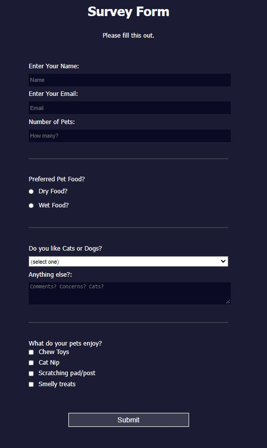

# Objective: Build a Survey Form

### Build a survey app that is functionally similar to https://tribute-page.freecodecamp.rocks.

<strong>User Stories:</strong>

1. <input type="checkbox" checked/> You should have a page title in an `h1` element with an `id` of `title`
2. <input type="checkbox" checked/> You should have a short explanation in a `p` element with an `id` of `description`
3. <input type="checkbox" checked/> You should have a `form` element with an `id` of `survey-form`
4. <input type="checkbox" checked/> Inside the `form` element, you are required to enter your name in an input field that has an `id` of `name` and a `type` of `text`
5. <input type="checkbox" checked/> Inside the form element, you are required to enter your email in an `input` field that has an `id` of `email`
6. <input type="checkbox" checked/> If you enter an email that is not formatted correctly, you will see an _HTML5_ validation error
7. <input type="checkbox" checked/> Inside the form, you can enter a number in an `input` field that has an `id` of `number`
8. <input type="checkbox" checked/> The number input should not accept non-numbers, either by preventing you from typing them or by showing an _HTML5_ validation error (depending on your browser)
9. <input type="checkbox" checked/> If you enter numbers outside the range of the number input, which are defined by the `min` and `max` attributes, you will see an _HTML5_ validation error
10. <input type="checkbox" checked/> For the name, email, and number input fields, you can see corresponding `label` elements in the form, that describe the purpose of each field with the following ids: `id="name-label"`, `id="email-label"`, and `id="number-label"`
11. <input type="checkbox" checked/> For the name, email, and number input fields, you can see placeholder text that gives a description or instructions for each field
12. <input type="checkbox" checked/> Inside the `form` element, you should have a select dropdown element with an `id` of `dropdown` and at least two options to choose from
13. <input type="checkbox" checked/> Inside the `form` element, you can select an option from a group of at least two radio buttons that are grouped using the `name` attribute
14. <input type="checkbox" checked/> Inside the `form` element, you can select several fields from a series of checkboxes, each of which must have a `value` attribute
15. <input type="checkbox" checked/> Inside the `form` element, you are presented with a `textarea` for additional comments
16. <input type="checkbox" checked/> Inside the `form` element, you are presented with a button with `id` of `submit` to submit all the inputs

<!-- _Note: Be sure to add <link rel="stylesheet" href="styles.css"> in your HTML to link your stylesheet and apply your CSS_ -->

## Project Preview

_This is a survey about pets, or really, just cats_

