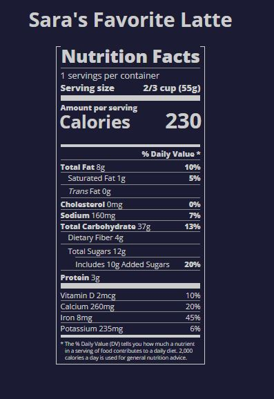

# Typography

### _Typography is the art of styling your text to be easily readable and suit its purpose._

In this course, you'll use typography to build a nutrition label webpage. You'll learn how to style text, adjust line height, and position your text using CSS.

<link rel="stylesheet" href="styles.css">

## Project Preview

_This is a faux-label for my favorite drink: <strong>Starbucks Vanilla Latte</strong>_

