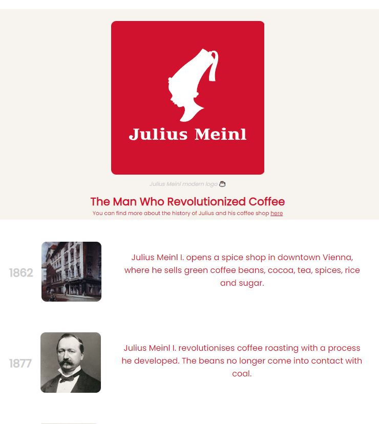
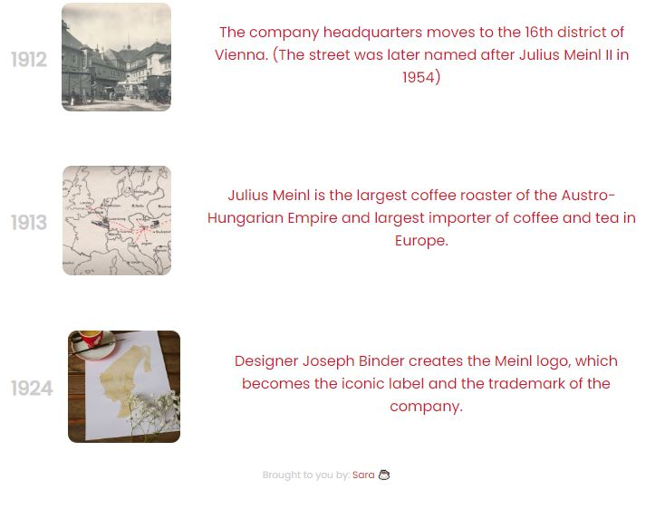

# Objective:

### Build an app that is functionally similar to https://tribute-page.freecodecamp.rocks.

<strong>User Stories:</strong>

1. <input type="checkbox" checked/> Your tribute page should have a `main` element with a corresponding `id` of `main`, which contains all other elements
2. <input type="checkbox" checked/> You should see an element with an `id` of `title`, which contains a string (i.e. text), that describes the subject of the tribute page _(e.g. "Dr. Norman Borlaug")_
3. <input type="checkbox" checked/> You should see either a `figure` or a `div` element with an `id` of `img-div`
4. <input type="checkbox" checked/> Within the `#img-div` element, you should see an `img` element with a corresponding `id="image"`
5. <input type="checkbox" checked/> Within the `#img-div` element, you should see an element with a corresponding `id="img-caption"` that contains textual content describing the image shown in `#img-div`
6. <input type="checkbox" checked/> You should see an element with a corresponding `id="tribute-info"`, which contains textual content describing the subject of the tribute page
7. <input type="checkbox" checked/> You should see an `a` element with a corresponding `id="tribute-link"`, which links to an outside site, that contains additional information about the subject of the tribute page. <strong>HINT:</strong> _You must give your element an attribute of `target` and set it to `_blank` in order for your link to open in a new tab_
8. <input type="checkbox" checked/> Your `#image` should use `max-width` and `height` properties to resize responsively, relative to the width of its parent element, without exceeding its original size
9. <input type="checkbox" checked/> Your `img` element should be centered within its parent element

_Note: Be sure to add <link rel="stylesheet" href="styles.css"> in your HTML to link your stylesheet and apply your CSS_

## Tests:

- <input type="checkbox" checked/> : You should have a main element with an id of main.
- <input type="checkbox" checked/> : Your `#img-div`, `#image`, `#img-caption`, `#tribute-info`, and `#tribute-link` should all be descendants of #main.
- <input type="checkbox" checked/> : You should have an element with an `id` of `title`.
- <input type="checkbox" checked/> : Your `#title` should not be empty.
- <input type="checkbox" checked/> : You should have a `figure` or `div` element with an `id` of `img-div`.
- <input type="checkbox" checked/> : You should have an `img` element with an `id` of `image`.
- <input type="checkbox" checked/> : Your #image should be a descendant of #`img-div`.
- <input type="checkbox" checked/> : You should have a `figcaption` or `div` element with an `id` of `img-caption`.
- <input type="checkbox" checked/> : Your `#img-caption` should be a descendant of `#img-div`.
- <input type="checkbox" checked/> : Your `#img-caption` should not be empty.
- <input type="checkbox" checked/> : You should have an element with an `id` of `tribute-info`.
- <input type="checkbox" checked/> : Your `#tribute-info` should not be empty.
- <input type="checkbox" checked/> : You should have an a element with an `id` of `tribute-link`.
- <input type="checkbox" checked/> : Your `#tribute-lin`k should have an `href` attribute and value.
- <input type="checkbox" checked/> : Your `#tribute-link` should have a target attribute set to `\_blank`.
- <input type="checkbox" checked/> : Your `img` element should have a display of `block`.
- <input type="checkbox" checked/> : Your `#image` should have a `max-width` of `100%`.
- <input type="checkbox" checked/> : Your `#image` should have a `height` of `auto`.
- <input type="checkbox" checked/> : Your `#image` should be centered within its parent.

